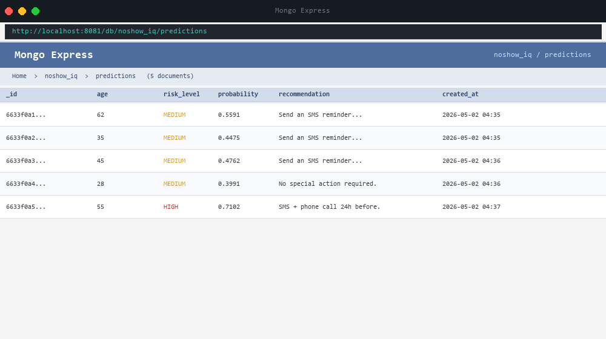
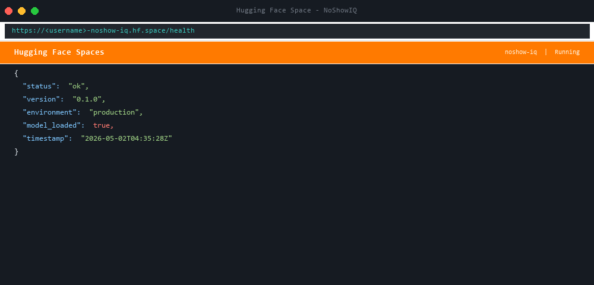

# NoShowIQ — Clinic Appointment No-Show Predictor

> **SAP ID: 66426** · MLOps Assignment

NoShowIQ is a production-style machine learning API that predicts whether a
clinic patient is likely to miss their appointment. It combines scikit-learn,
FastAPI, MongoDB, Docker, and automated CI/CD into a single clean project.

---

## Table of Contents

1. [Project Overview](#1-project-overview)
2. [Folder Structure](#2-folder-structure)
3. [Environment Variables](#3-environment-variables)
4. [Local Setup](#4-local-setup)
5. [Train the Model](#5-train-the-model)
6. [Run the API Locally](#6-run-the-api-locally)
7. [Run Tests](#7-run-tests)
8. [Docker Usage](#8-docker-usage)
9. [API Reference](#9-api-reference)
10. [CI/CD Pipeline](#10-cicd-pipeline)
11. [Deployment](#11-deployment)
12. [Screenshots](#12-screenshots)

---

## 1. Project Overview

| Item | Detail |
|------|--------|
| **Model** | Logistic Regression (`class_weight="balanced"`) |
| **Dataset** | Brazilian clinic appointments (~110k rows) from Kaggle |
| **Target** | `no_show` — 1 if patient missed appointment, 0 if they came |
| **Features** | Age, scholarship, hypertension, SMS received, days in advance, etc. |
| **API** | FastAPI, 4 endpoints |
| **Database** | MongoDB (predictions + training runs) |
| **Package** | Published to TestPyPI |
| **Deploy** | Docker Hub + Hugging Face Spaces |

---

## 2. Folder Structure

```
noshow-iq-66426/
├── noshow_iq/          ← Python package
│   ├── __init__.py
│   ├── config.py       ← environment variable loader
│   ├── preprocess.py   ← data cleaning + feature engineering
│   ├── model.py        ← train / predict / evaluate
│   ├── api.py          ← FastAPI app
│   └── db.py           ← MongoDB helpers
├── tests/              ← pytest test suite
├── data/raw/           ← raw CSV (not committed)
├── models/             ← model.joblib (not committed)
├── .github/workflows/  ← GitHub Actions
├── Dockerfile
├── docker-compose.yml
├── requirements.txt
├── pyproject.toml
├── smoke_test.py
└── README.md
```

---

## 3. Environment Variables

Copy `.env.example` to `.env` and fill in your values:

```bash
cp .env.example .env
```

| Variable | Description | Default |
|----------|-------------|---------|
| `MONGO_URI` | MongoDB connection string | `mongodb://localhost:27017` |
| `MONGO_DB_NAME` | Database name | `noshow_iq` |
| `MODEL_PATH` | Path to serialised model | `models/model.joblib` |
| `APP_ENV` | `development` / `production` | `development` |

**Never commit your real `.env` file** — it is listed in `.gitignore`.

---

## 4. Local Setup

```bash
# Clone the repo
git clone https://github.com/<your-username>/noshow-iq-66426.git
cd noshow-iq-66426

# Create and activate a virtual environment
python -m venv .venv
source .venv/bin/activate        # Linux / macOS
.venv\Scripts\activate           # Windows PowerShell

# Install all dependencies
pip install -r requirements.txt

# Copy environment template
cp .env.example .env
# Edit .env and fill in MONGO_URI etc.
```

---

## 5. Train the Model

Download the full dataset from Kaggle (Medical Appointment No Shows) and save
it as `data/raw/appointments.csv`, then run:

```bash
python -m noshow_iq.model data/raw/appointments.csv
```

This will:
- Clean and engineer features
- Train a LogisticRegression pipeline
- Print precision / recall / F1 for both classes
- Save `models/model.joblib`
- Store the run metrics in MongoDB

---

## 6. Run the API Locally

```bash
# Make sure MongoDB is running (or use Docker Compose)
uvicorn noshow_iq.api:app --reload --port 8000
```

Open your browser at:
- **API docs:** `http://localhost:8000/docs`
- **Health check:** `http://localhost:8000/health`

---

## 7. Run Tests

```bash
# Run the full test suite
pytest tests/ -v

# Run a single file
pytest tests/test_preprocess.py -v

# Also run linting
flake8 noshow_iq/ tests/ smoke_test.py --max-line-length=100
```

---

## 8. Docker Usage

```bash
# Build and start all three services (app + mongodb + mongo-express)
docker compose up --build

# Visit:
#   API:          http://localhost:8000/docs
#   Mongo-Express: http://localhost:8081

# Stop and remove containers + volumes
docker compose down -v
```

**Build the image only:**

```bash
docker build -t noshow-iq .
docker run -p 8000:8000 --env-file .env noshow-iq
```

---

## 9. API Reference

### `GET /health`

Returns the liveness status of the API.

```bash
curl http://localhost:8000/health
```

```json
{
  "status": "ok",
  "version": "0.1.0",
  "environment": "development",
  "model_loaded": true,
  "timestamp": "2024-01-01T12:00:00+00:00"
}
```

---

### `POST /predict`

Predict no-show risk for a single appointment.

```bash
curl -X POST http://localhost:8000/predict \
  -H "Content-Type: application/json" \
  -d '{
    "age": 35,
    "scholarship": 0,
    "hypertension": 0,
    "diabetes": 0,
    "alcoholism": 0,
    "handicap": 0,
    "sms_received": 1,
    "days_in_advance": 7,
    "appointment_weekday": 2
  }'
```

```json
{
  "probability": 0.72,
  "risk_level": "HIGH",
  "recommendation": "Send SMS reminder + phone call 24 h before the appointment.",
  "model_version": "0.1.0"
}
```

**Risk levels:**

| Level | Probability | Action |
|-------|-------------|--------|
| LOW | < 0.40 | No action needed |
| MEDIUM | 0.40 – 0.69 | Send SMS reminder |
| HIGH | ≥ 0.70 | SMS + phone call |

---

### `GET /history`

Returns the last 20 predictions from MongoDB.

```bash
curl http://localhost:8000/history
```

---

### `GET /stats`

Returns aggregated statistics computed by a MongoDB pipeline.

```bash
curl http://localhost:8000/stats
```

```json
{
  "total_predictions": 150,
  "avg_probability": 0.4123,
  "by_risk_level": {
    "HIGH": 32,
    "LOW": 89,
    "MEDIUM": 29
  }
}
```

---

## 10. CI/CD Pipeline

| Workflow | Trigger | Steps |
|----------|---------|-------|
| `lint.yml` | Push / PR to `main` | flake8 |
| `ci-cd.yml` | Push / PR to `main` | flake8 → pytest → Docker build → Docker Hub push → HF Space restart |

**Required GitHub Secrets:**

| Secret | Purpose |
|--------|---------|
| `DOCKER_HUB_USERNAME` | Docker Hub account name |
| `DOCKER_HUB_TOKEN` | Docker Hub access token |
| `HF_TOKEN` | Hugging Face write token |
| `HF_SPACE` | e.g. `yourname/noshow-iq` |

---

## 11. Deployment

### Docker Hub

```bash
docker login
docker build -t <username>/noshow-iq:latest .
docker push <username>/noshow-iq:latest
```

### Hugging Face Spaces

1. Create a new Space with **Docker** SDK.
2. Set the Space's secrets: `MONGO_URI`, `MONGO_DB_NAME`, `MODEL_PATH`.
3. Add the `HF_SPACE` and `HF_TOKEN` secrets in GitHub — the CI/CD pipeline
   will restart the Space automatically on every push to `main`.

### Smoke test against live deployment

```bash
python smoke_test.py https://your-space.hf.space
```

### Publish to TestPyPI

```bash
pip install build twine
python -m build
twine upload --repository testpypi dist/*
```

---

## 12. Screenshots

> Replace the placeholders below with actual screenshots once deployed.

**API Docs (`/docs`)**


**Mongo Express UI**



**GitHub Actions green pipeline**


**Hugging Face Space**



---

## License

MIT — see [LICENSE](LICENSE).
